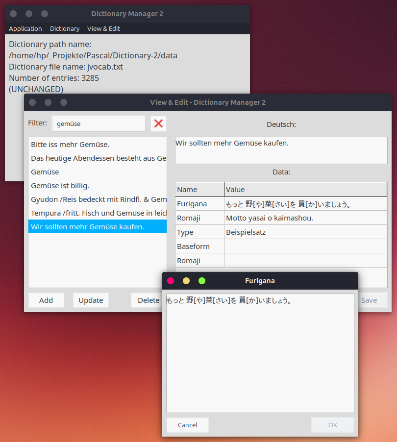

# Dictionary Manager 2 (Pascal)

A simple dictionary manager written in [Free Pascal](https://www.freepascal.org/) with the [Lazarus IDE](https://www.lazarus-ide.org/) for viewing and editing text files with lines in the form:

    key TAB data1 TAB data2 TAB ...

Keys must be unique - when reading the data file, subsequent lines with 
identical keys are ignored.

This version **"Dictionary Manager 2"** displays the TAB-separated data not in a single text field (see [Version 1](https://github.com/hapepo23/dictionary-manager-pascal)), but instead in tabular form with field names. These must be defined in the first line of the data file in the form:

    #keyname TAB dataname1 TAB dataname2 TAB ...

If this is not the case, the data fields are simply labeled with numbers.

You may double click on the name field to open a bigger text window to view or edit the corresponding value.

Screenshot Linux:

The displayed data record is saved as:

    Wir sollten mehr Gemüse kaufen. TAB もっと 野[や]菜[さい]を 買[か]いましょう。 TAB
    Motto yasai o kaimashou. TAB Beispielsatz

The first line in the file is:

    #Deutsch TAB Furigana TAB Romaji TAB Type TAB Baseform TAB Romaji

The following applies to the file './data/handedict.txt': Chinese-German Dictionary "HanDeDict", License: CC BY-SA 2.0, [Download link](https://handedict.zydeo.net/de/download), file was created Oct. 2025.